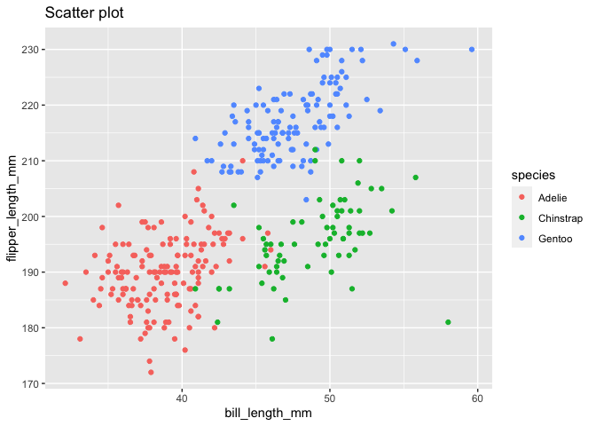

Homework 1
================
Qianhui Xu

\#\#\#Problem 1

\#Create a data frame with the specified elements.

``` r
prob1_df = 
  tibble(
   samp_numeric = rnorm(10, sd = 1),
   samp_logical = samp_numeric > 0,
   char_vec = c("A", "A", "B", "B", "A", "C", "B", "C", "C", "A"),
  factor_vec = factor(c("high", "high", "mid", "mid", "high", "low", "mid", "low", "low", "high"))
  )
```

\#Means

``` r
mean(pull(prob1_df,samp_numeric))
```

    ## [1] 0.101668

``` r
mean(pull(prob1_df, samp_logical))
```

    ## [1] 0.5

``` r
mean(pull(prob1_df, char_vec))
```

    ## Warning in mean.default(pull(prob1_df, char_vec)): argument is not numeric or
    ## logical: returning NA

    ## [1] NA

``` r
mean(pull(prob1_df, factor_vec))
```

    ## Warning in mean.default(pull(prob1_df, factor_vec)): argument is not numeric or
    ## logical: returning NA

    ## [1] NA

\#What works and what doesn’t?

Take the mean of each variable in my data frame.I found that we could
obtain the means for numeric vector and logical vector. However, we
could not obtain the means for character vector, and factor vector.

\#Convert

``` r
as.numeric(pull(prob1_df, samp_logical))
as.numeric(pull(prob1_df, char_vec))
as.numeric(pull(prob1_df, factor_vec))
```

\#What happens and why?

The logical and factor variables can be converted to numeric variables.
For logical variables which is stored as 0 (FALSE) and 1 (TRUE).
Therefore, our “FALSE” could be converted to 0 ,our “TRUE” could be
converted to 1. For factor variables, elements could be converted to
numeric integers.However, the character variable could not be converted
to numeric variable.

\#Problem1,second code chunk

``` r
as.numeric(pull(prob1_df, samp_logical)) * pull(prob1_df, samp_numeric)
```

    ##  [1] 0.0000000 1.0513653 0.0000000 0.1499919 0.0000000 0.7804970 0.9735501
    ##  [8] 0.0000000 0.0000000 0.1237521

``` r
factor(pull(prob1_df, samp_logical)) * pull(prob1_df, samp_numeric)
```

    ## Warning in Ops.factor(factor(pull(prob1_df, samp_logical)), pull(prob1_df, : '*'
    ## not meaningful for factors

    ##  [1] NA NA NA NA NA NA NA NA NA NA

``` r
as.numeric(factor(pull(prob1_df, samp_logical))) * pull(prob1_df, samp_numeric)
```

    ##  [1] -0.43206811  2.10273053 -0.07378135  0.29998379 -0.51412205  1.56099390
    ##  [7]  1.94710022 -1.01955262 -0.02295201  0.24750425

\#\#\#Problem 2

``` r
data("penguins", package = "palmerpenguins")
```

\#discription of the dataset

\#variable name of the dataset

\#the size of the data set rows 344 columns 8 the size 344\*8

\#the mean flipper length 200.9152047 .

\#the median weight 4050.

\#scatterplot and save

``` r
#create scatterplot and related labels

ggplot(penguins, aes(x = bill_length_mm, y = flipper_length_mm, color = species)) + geom_point() + ggtitle("Scatter plot")
```

    ## Warning: Removed 2 rows containing missing values (geom_point).

<!-- -->

``` r
#save the scatter plot

ggsave("scatterplot_penguins.pdf", height = 4, width = 6)
```

    ## Warning: Removed 2 rows containing missing values (geom_point).
